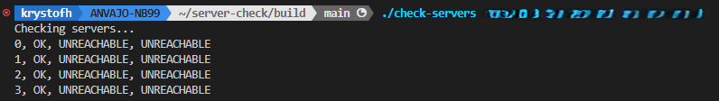
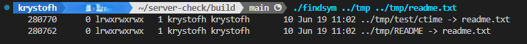

# Unix system tools

## Server-check

### Description

Testing availability of one or multiple servers using ping command executed in parallel.
The program `check-servers` sends a request to each server once each second. If the response is not obtained within the 1 s period,
it qualifies as `UNREACHABLE`, otherwise `OK`. The execution is done through threading using `pthread`.

Source code:

> check-servers.c

### Usage

```bash
./check-servers IP1 IP2 ...
```

### Example



## Symbolic link check

### Description

The program searches recursively for all symbolic links leading to a file.

Source code:

> findsym.c

### Usage

```
./findsym <PARENT_FOLDER> <FILE>
```

### Example



## Sources

1. Unix Threads in C: https://www.youtube.com/watch?v=d9s_d28yJq0&list=PLfqABt5AS4FmuQf70psXrsMLEDQXNkLq2
2. https://www.geeksforgeeks.org/multithreading-in-c/
3. https://linux.die.net/man/1/find
4. https://linux.die.net/man/3/basename
5. certain level of support from StackOverflow and ChatGPT


